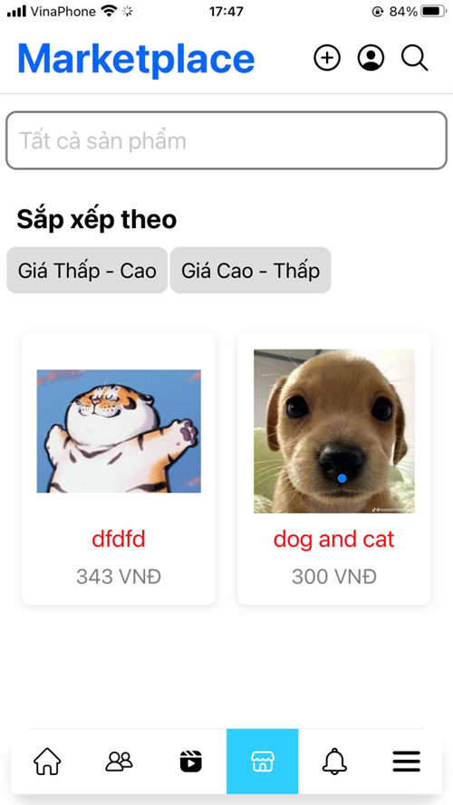

# Ứng dụng Social Network 🏍️
  

Ứng dụng thi bằng lái xe máy A1 với nhiều chức năng khác nhau giúp người luyện thi nắm chắc kiến thức 
## Chức năng
- Quản lý tài khoản (Đăng nhập, đăng ký, đăng xuất, thay đổi mật khẩu, khôi phục tài khoản).
- Quản lý bài đăng
- Quản lý bài đăng sản phẩm
- Quản lý Reel
- Quản lý nhắn tin
- Quản lý bạn bè
- Quản lý nhóm
- Quản lý thông báo

## Công nghệ
Ứng dụng GPLX là ứng dụng được viết bằng Javascript và sử dụng Supabase làm database và một số thư viện hỗ trợ UI

## Một vài hình ảnh demo

<div style="display: flex; justify-content: space-around;">
  
  
   
  
    
     
       
       
  
</div>

## Hướng dẫn chạy trên máy ảo
1. **Cài đặt Visual Studio Code**: [Tải xuống Visual Studio Code](https://code.visualstudio.com/)

2. **Cài đặt môi trường Node.js**: 
   ```sh
   https://nodejs.org/en/download/package-manager

3. **Download Android Studio để chạy máy ảo**: [Tải xuống Android Studio ](https://developer.android.com/studio/install?hl=vi)

3. **Download source code bằng câu lệnh**:
```sh
git clone https://github.com/tnamIT299/GPLX.git
```

4. **Cài đặt các phụ thuộc**:
```sh
cd GPLX
npm install
```

5. **Chạy ứng dụng**:
```sh
npm start
```
## License
MIT

